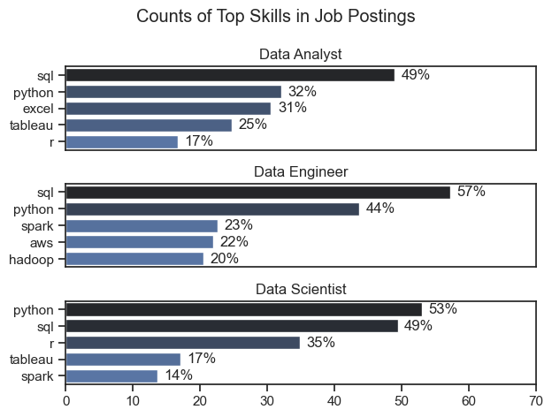
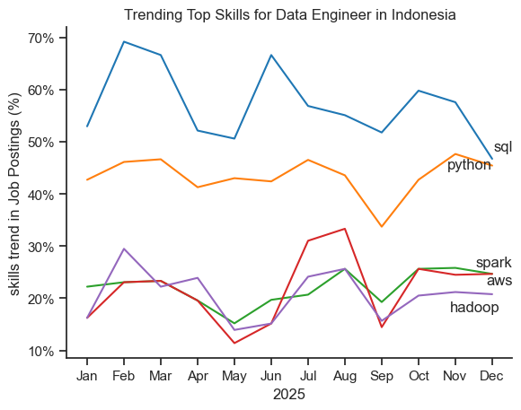
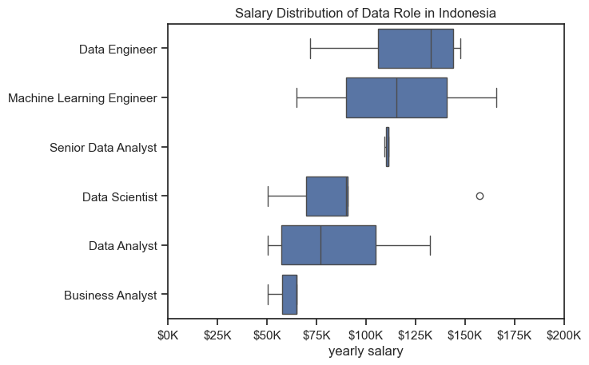
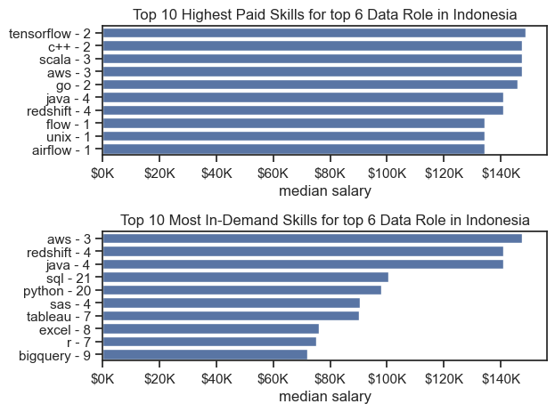

# The Analysis

## 1. what are the most demanded skills for the top 3 most popular data roles in Indonesia?

To find the most demanded skills for the top 3 most popular data roles in Indonesia. I filtered out those positions by which ones were the most popular, and got the top 5 skills for these top 3 roles. This query highlights the most popular job titles and their top skills by analyzing how frequently each title appears in job postings and how often each skill is mentioned for that position.

view the detailed steps here: [skill_demand.ipynb](2_skill_demand.ipynb)

### Visualize Data
```python
df_skills_perc = pd.merge(df_skills_count, df_job_title_count, how='left', on='job_title_short' )

df_skills_perc['skill_percent'] = (df_skills_perc['skill_count'] / df_skills_perc['jobs_total']) * 100

ig, ax = plt.subplots(len(job_titles), 1)
sns.set_theme(style='ticks')

for idx, title in enumerate(job_titles):
    df_plot = df_skills_perc[df_skills_perc['job_title_short'] == title].head(5)
    sns.barplot(data=df_plot, y='job_skills', x='skill_percent', ax=ax[idx], hue='skill_count', palette='dark:b_r')
    ax[idx].set_ylabel('')
    ax[idx].set_xlabel('')
    ax[idx].legend().set_visible(False)
    ax[idx].set_title(title)
    ax[idx].set_xlim(0,70)

    for i, v in enumerate(df_plot['skill_percent']):
        ax[idx].text(v + 1, i, f'{v:.0f}%', va='center')
    
    if idx != len(job_titles) - 1:
        ax[idx].set_xticks([])

fig.suptitle('Counts of Top Skills in Job Postings')
fig.tight_layout()
plt.show()
```


### Results


### Insights
- SQL is the most sought after skill for data roles in Indonesia, with a 49% demand in Data Analyst positions and 57% demand in Data Engineering roles.
- Python is a versatile skill with high demand across all of the top 3 data roles in Indonesia, even surpassing SQL in demand for Data Scientist positions.
- Data Engineers require broader cloud and big data skills. Skills like Spark (23%), AWS (22%), and Hadoop(20%) show that Data Engineer roles emphasize distributed computing and cloud infrastructure.

## 2. How are in demand skills trending for Data Engineer in Indonesia?

To find the monthly trend of in demand skills for Data Engineer in Indonesia, I first explode the job skill column in the dataframe. Then i pivoted the table to organize the data by job skill and the month the job was posted. To calculate the percentage values, i grouped the data by month to get the total job postings for each month, and then divided each skill's count by the corresponding m onthly total.

view the detailed steps here: [skill_trend.ipynb](3_skill_trend.ipynb)

### Visualize Data

```python
df_plot = df_percent[top_5_skills]
sns.set_theme(style='ticks')
sns.lineplot(data=df_plot, dashes=False, palette='tab10')
sns.despine()

plt.xlabel('2025')
plt.ylabel('skills trend in Job Postings (%)')
plt.legend().remove()

sorted_dec = df_plot.iloc[-1].sort_values(ascending=False)
minimum_dist = 2.5
prev_val = -99
texts = []
for idx in range(5):
    cur_val = sorted_dec.iloc[idx] 
    if not prev_val == -99:
        diff = prev_val - cur_val
        cur_val = cur_val - (minimum_dist - diff )if diff < minimum_dist else cur_val
    texts.append(plt.text(11,cur_val , df_plot.columns[idx]))
    prev_val = cur_val 
adjust_text(texts, arrowstyle='->', color='gray', lw=0.5)

ax = plt.gca()
ax.yaxis.set_major_formatter(PercentFormatter(decimals=0))

plt.show()
```

### Results


### Insights
- SQL remained the most consistently in demand skill for Data Engineer throughout the year, although it shows a gradual decline in demand
- Python showed a steady increase in demand throughout the year. Although there was a dim in September, demand surged significantly by year end. It even has the potential to overtake SQL as the most in demand skill for Data Engineer in the future
- Hadoop showed an overal decline, stabilizing at a lower demand level aftear peaking in February. This may reflect a shift away from traditional big data framework toward more modern cloud based or real time platforms. 

## 3. How well do top data jobs pay in Indonesia?

To answer this question, I will break it down into two parts. First, I will identify the six most popular data roles in Indonesia by analyzing the number of job listings and their median annual salary distribution. Second, from these top six roles, I will compare the most in-demand skills with the highest-paying skills to determine which ones are the most worthwhile to learn.

view the detailed steps here: [salary_analysis.ipynb](4_salary_analysis.ipynb)

### a. Salary Distribution for top Data Role in Indonesia

### Visualize Data

```python
sns.boxplot(data=df_ID_top6, x='salary_year_avg', y='job_title_short', order=top_6_Order)
ax = plt.gca()
ax.xaxis.set_major_formatter(plt.FuncFormatter(lambda x, pos: f'${int(x/1000)}K'))
plt.xlim(0,200000)
plt.title('Salary Distribution of Data Role in Indonesia')
plt.ylabel('')
plt.xlabel('yearly salary')

plt.show()
```

### Result



### Insight
- Business Analyst have the lowest median salary among the data roles in Indonesia, which may suggest that roles requiring stronger technical or programming skills are generally more highly valued in terms of compensation
- Senior Data Analyst shows a notable increase in median salary along with a narrower salary range compared to Data Analyst Position, suggesting more consistent and standardized compensation at the senior level
- The lower end salary for Data Engineers is approximately equal to the median salary of Senior Data Analyst, indicating that even entry or mid level Data Engineers are compensated on par with more experienced analysts.

### b. skill demand vs salary for top data roles in Indonesia

### Visualize Data

```python
fig, ax = plt.subplots(2,1)
sns.set_theme(style='ticks')
sns.barplot(data=df_ID_MostPaidGroup, x='median', y=df_ID_MostPaidGroup.index, ax=ax[0], legend=False)
ax[0].xaxis.set_major_formatter(plt.FuncFormatter(lambda x, pos: f'${int(x/1000)}K'))
ax[0].set_title('Top 10 Highest Paid Skills for top 6 Data Role in Indonesia')
ax[0].set_xlabel('median salary')
ax[0].set_ylabel('')
oldTickText = [tick.get_text() for tick in ax[0].get_yticklabels()]
newTickText = [f'{text} - {df_ID_MostPaidGroup.iloc[i,0]}' for i, text in enumerate(oldTickText)]
ax[0].set_yticks(ax[0].get_yticks())
ax[0].set_yticklabels(newTickText)

sns.barplot(data=df_ID_MostDemandGroup, x='median', y=df_ID_MostDemandGroup.index, ax=ax[1], legend=False)
ax[1].set_xlim(ax[0].get_xlim())
ax[1].xaxis.set_major_formatter(plt.FuncFormatter(lambda x, pos: f'${int(x/1000)}K'))
ax[1].set_title('Top 10 Most In-Demand Skills for top 6 Data Role in Indonesia')
ax[1].set_xlabel('median salary')
ax[1].set_ylabel('')
oldTickText = [tick.get_text() for tick in ax[1].get_yticklabels()]
newTickText = [f'{text} - {df_ID_MostDemandGroup.iloc[i,0]}' for i, text in enumerate(oldTickText)]
ax[1].set_yticks(ax[1].get_yticks())
ax[1].set_yticklabels(newTickText)

fig.tight_layout()
plt.show()
```

### Result


### Insight
- While Python and SQL are not among the highest-paying skills, they are by far the most in demand, appearing in 20 and 21 job listings respectively. This makes them essential foundational skills and a smart starting point for anyone entering the data field.
- Most of the highest-paying skills do not appear among the most in-demand, indicating that these skills are more specialized and niche. They are likely required for fewer, but more advanced or critical roles, which drives up compensation due to limited supply and higher expertise requirements.
- Skills like Excel, Tableau, and R are relatively in demand in Indonesia, but they do not command the highest salaries compared to other skills. These skills are often associated with analyst roles, which are generally easier to fill and considered less technically intensive or critical than engineering or machine learning positions.